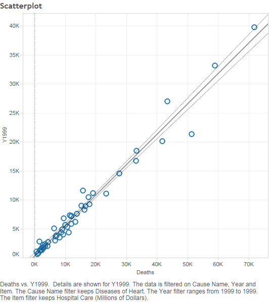

#Health Care and Causes of Death by State

####This is Project 4 for Dr. Cannata's Data Visualization class.

###Introduction

We have been working with these same two datasets (first is US healthcare expenditures over time, and second is US Causes of Death by State) for multiple R projects, so it was interesting to finally work with this data in Tableau. With the enhanced capability of Tableau, we wanted to drill down deeper into healthcare expenditures by item (hospital care, dental care, prescription drugs, etc.) and correlate these figures with deaths.

###Loading our data from the Oracle Database

####Dataset 1: National Healthcare Expenditures
We modified the R script given to us to create a SQL code that would create the table in the Oracle Database.  We then loaded our data and could connect to the database to create our data frame in RStudio.
```{r}
source("../01 Data/Project3_ETL_Data1.R", echo = TRUE)
```

####Dataset 2: Cause of Death
```{r}
source("../01 Data/Project3_ETL_Data2.R", echo = TRUE)
```

###Visualization #1: Crosstab

This crosstab has states for its rows and healthcare expenditure items for its columns. The KPI inside the crosstab is the average annual percentage growth in expenditures, year over year from 1980 - 2009. The growth rates are separated as High (KPI > 10%), Medium (7% < KPI < 10%), and Low (KPI < 7%) according to our Tableau parameters. 


From this crosstab, we easily see that the expenditure items with the fastest-growing expenditures are Home Health Care; Other Health, Residential, and Personal Care; Other Professional Services; and Prescription Drugs. As the next graph (Visualization 2: Bar Chart) shows, it's possible that these items' growth rates are exaggerated because they started off as such negligibly low numbers.

The expenditure items with the slowest-growing expenditures are Dental Services, Durable Medical Products, and Other Non-Durable Medical Products. We believe that expenditures on dental services and medical products have not increased as rapidly because they are less closely tied to rising health insurance costs, which are generally blamed for rising healthcare costs.

The states with the fastest-growing expenditures are Arizona, Delaware, Florida, Nevada, and North Carolina. The states with the slowest-growing expenditures are New York, Michigan, Illinois, Iowa, and the District of Columbia. We found little correlation between states here to suggest any concentration based on regional or political characteristics.

###Visualization 2: Bar Chart

This bar chart has Expenditures in millions for its y-axis and Years for its x-axis. The bars are broken down by item, and all data has been filtered to only include the state of Texas.


This chart perfectly captures the rising costs of healthcare in Texas, and more broadly, the United States (we can infer this because of the previous crosstab; Texas's annual percentage growth numbers are very similar to those of the other states, so their expenditures can be expected to have grown at a similar rate). The cost rise is fairly uniform across items. In other words, the relative composition by item of each of the bars remains relatively the same from 1980-2009. Therefore, we conclude that, with a few exceptions, US healthcare costs rose uniformly by item from 1980-2009. If anything, the overall rate of growth accelerated in the 2000s. For future consideration and if data is available, it would be interesting to see how this trend has changed with the institution of Obamacare.

###Visualization 3: Scatterplot

This scatterplot has Hospital Care expenditures (represented here as Y1999) for the y-axis and number of deaths for the x-axis. The data points represent each of the 50 states, plus the null value for US territories. We filtered to reduce the scope and improve the graph's readability by only showing data from the year 1999 and causes of death related to heart disease.



From viewing the scatterplot and associated three trendlines. we see that there is a clear positive correlation between heart disease deaths and hospital care expenditures. This is expected, as both statistics are likely caused by a third variable, state population. We expect that similar positive correlations will exist regardless of the filters we place on state, cause of death, and expenditure item because of the results of the prior Crosstab and Bar Chart. These results showed that healthcare expenditures are relatively homogeneous across states and expenditure items. For the most part, they rose everywhere from 1980 - 2009. This is likely why the Obama administration has been so adamant about standardizing health care policy across the United States, and not having it vary by state or expenditure item. Therefore, our analysis and above charts help explain why Obamacare has grown to cover policy at a comprehensive federal level.
